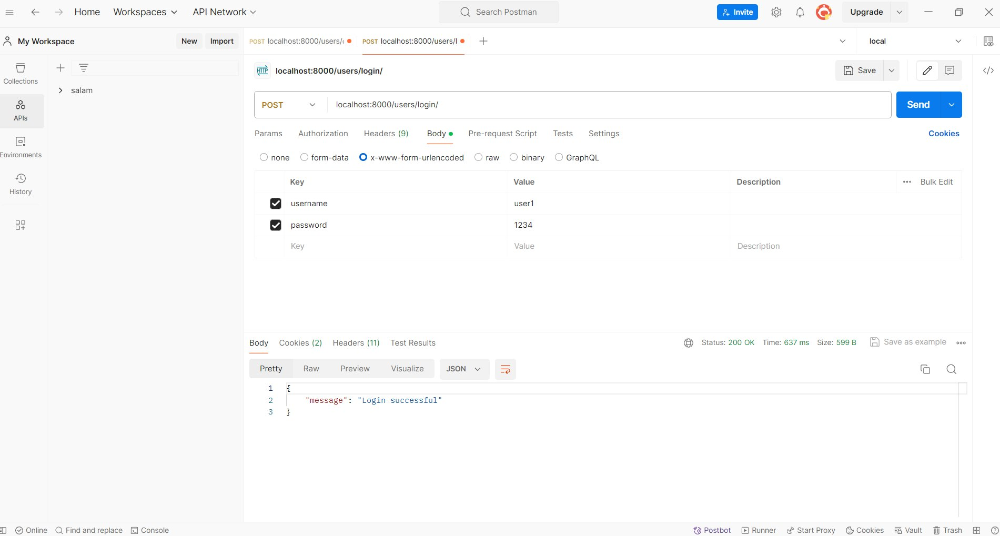

# SE_lab_s6
## فایل های مورد نیاز برای اجرای پروژه بر روی داکر عبارت اند از : dockerfile و docker-compose.yml
## dockerfile
```dockerfile
# Base image
FROM python:3.10

# Set work directory
WORKDIR /code

# Install dependencies
COPY requirements.txt /code/
RUN pip install --no-cache-dir -r requirements.txt

# Copy project files
COPY . /code/
```
### عملکرد کد بالا
* از تصویر پایهٔ Python 3.10 استفاده می‌کند.
* دایرکتوری کاری داخل کانتینر را روی /code تنظیم می‌کند.
* فایل requirements.txt را کپی کرده و پکیج‌ها را نصب می‌کند.
* کل پروژه را داخل کانتینر کپی می‌کند.

---

## docker-compose.yml
```yml
version: '3.8'

services:
  web:
    build: .
    command: python manage.py runserver 0.0.0.0:8000
    volumes:
      - .:/code
    ports:
      - "8000:8000"
    depends_on:
      - db
    environment:
      - DB_NAME=postgres
      - DB_USER=postgres
      - DB_PASSWORD=postgres
      - DB_HOST=db
      - DB_PORT=5432


  db:
    image: postgres
    environment:
      POSTGRES_DB: postgres
      POSTGRES_USER: postgres
      POSTGRES_PASSWORD: postgres

```

### توضیح فایل docker-compose.yml

**نسخه Compose:**
استفاده از نسخه 3.8 برای تعیین قالب فایل (مربوط به `version:`)

---

### سرویس web (مربوط به Django)

* ساخت ایمیج پروژه از دایرکتوری فعلی با استفاده از Dockerfile (مربوط به `build:`)
* اجرای سرور توسعه جنگو روی پورت 8000 و شنیدن روی همه آدرس‌ها (مربوط به `command:`)
* اتصال سورس‌کد از سیستم میزبان به کانتینر برای بازتاب تغییرات به صورت زنده (مربوط به `volumes:`)
* در دسترس قرار دادن پورت 8000 کانتینر از طریق پورت 8000 میزبان (مربوط به `ports:`)
* مشخص‌کردن اینکه این سرویس باید پس از اجرای سرویس پایگاه‌داده شروع شود (مربوط به `depends_on:`)
* تعیین تنظیمات مربوط به اتصال به پایگاه‌داده مثل نام دیتابیس، کاربر، رمز عبور و آدرس (مربوط به `environment:`)

---

### سرویس db (مربوط به PostgreSQL)

* استفاده از ایمیج رسمی PostgreSQL به عنوان پایگاه‌داده (مربوط به `image:`)
* مقداردهی اولیه به پایگاه‌داده با تعریف نام دیتابیس، نام کاربری و رمز عبور (مربوط به `environment:`)

---
### تغییر در فایل setting.py
برای سازگاری پروژه با پایگاه داده بالا آمده،  کد زیر را در setting.py اضافه میکنیم

```python
DATABASES = {
    'default': {
        'ENGINE': 'django.db.backends.postgresql',
        'NAME': os.environ.get('DB_NAME', 'postgres'),
        'USER': os.environ.get('DB_USER', 'postgres'),
        'PASSWORD': os.environ.get('DB_PASSWORD', 'postgres'),
        'HOST': os.environ.get('DB_HOST', 'localhost'),
        'PORT': os.environ.get('DB_PORT', '5432'),
    }
}


```

## اجرا پروژه
### آماده سازی جداول در دیتابیس
برای آماده سازی جداول در پایگاه داده دستور زیر را ابتدا اجرا میکنیم:
```shell
docker-compose run web python manage.py migrate
```
### بالا آوردن container ها
برای بالا آوردن پروژه از دستور زیر استفاده میکنیم
```shell
docker-compose up -d
```
چون من تمامی image ها را از قبل داشتم باعث شد که دوباره دانلود نکند. 
اجرا شده کد بالا در تصویر پایین مشاهده میکنید.


# تعامل با داکر
## نشان دادن image ها
برای نشان image های داخل سیستم از دستور زیر استفاده میکنیم.
```shell
docker images
```

## نشان دادن container ها
```shell
docker ps -a
```

کانتینر های در حال اجرا مشخص است.
## دستور دلخواه
```shell
docker-compose exec web ls
```
این نشان می‌دهد که سورس‌کد پروژه داخل کانتینر در مسیر /code قرار دارد و به درستی mount شده است.


# پرسش ها 

### وظایف Dockerfile، Image و Container

* فایل Dockerfile فایلی متنی است که قدم‌به‌قدم توضیح می‌دهد چگونه باید یک محیط اجرا برای برنامه ساخته شود. مثلاً نصب پایتون، کپی کردن کد پروژه، نصب وابستگی‌ها و غیره.
* ایمیج (Image) خروجی نهایی‌ای است که از روی Dockerfile ساخته می‌شود. این ایمیج شامل همه چیزهایی است که برنامه برای اجرا نیاز دارد (مثلاً سیستم‌عامل، کتابخانه‌ها، کد برنامه). ایمیج‌ها تغییر نمی‌کنند و همیشه ثابت هستند.
* کانتینر (Container) یک نسخه فعال و در حال اجرای ایمیج است. وقتی یک ایمیج را اجرا می‌کنیم، تبدیل به کانتینر می‌شود. کانتینر مثل یک برنامه واقعی است که جدا از سیستم اصلی اجرا می‌شود و می‌توانیم چند نسخه از آن را همزمان اجرا کنیم.
---

### کاربرد Kubernetes و رابطه آن با داکر

* **کوبرنیتیس (Kubernetes)** ابزاری است که برای مدیریت و کنترل تعداد زیادی کانتینر استفاده می‌شود.
* **وظیفه کوبرنیتیس** اجرای خودکار، مقیاس‌دهی، بازگردانی و توزیع کانتینرها است.
* **رابطه کوبرنیتیس با داکر** این است که داکر کانتینر را اجرا می‌کند، ولی کوبرنیتیس آن را در مقیاس بزرگ مدیریت می‌کند.
* **به زبان ساده** داکر یک موتور ساخت و اجرای برنامه است و کوبرنیتیس یک مدیر برای تعداد زیادی از این برنامه‌هاست.

# تست وب سرور
تست وب سرور را در تصاویری که در ادامه آمده است، میتوانید مشاهده کنید.
* ساختن اکانت با استفاده از نام کاربری user1  و  رمز 1234


* سپس لاگین میکنیم


* مشاهده میکنید که کوکی ها نیز ست شده اند


* سپس یک note با title1 و body1 ساختیم


* سپس دومین note را نیز میسازیم


* در نهایت لیست note ها را مشاهده میکنید

